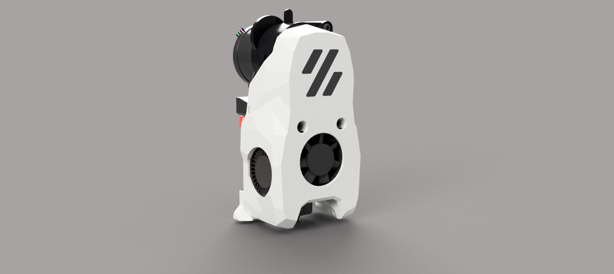
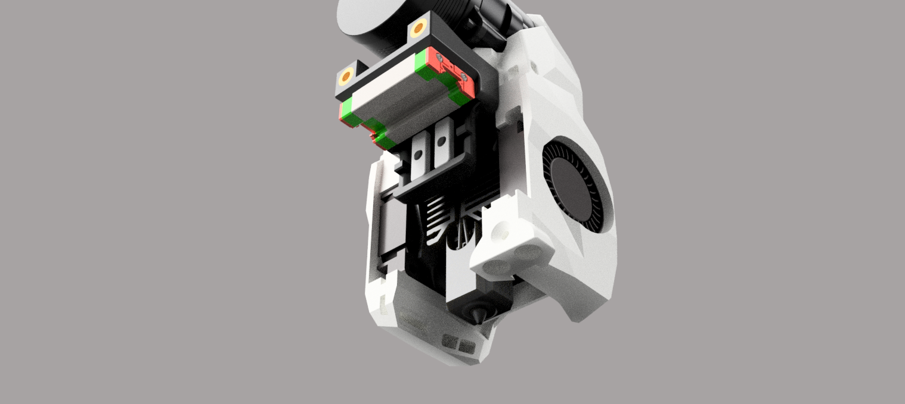
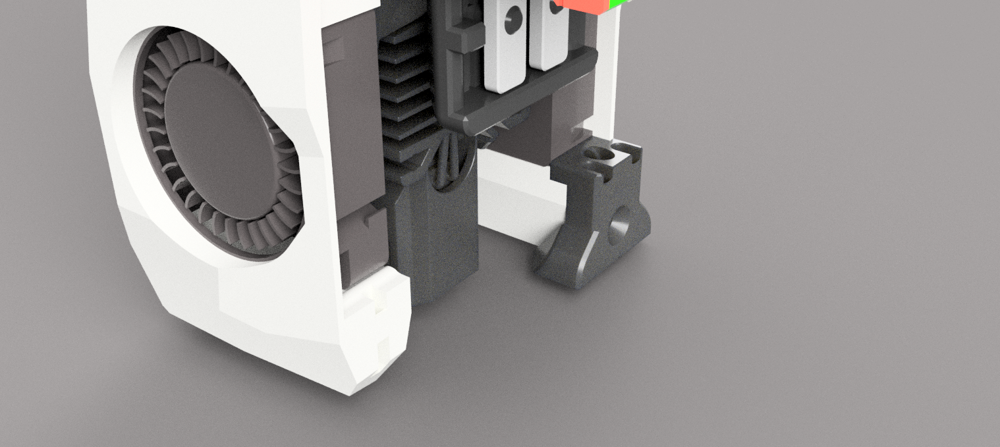

# MiniSB-Zero-Click
A modification of Maverick-3D's LGX-Lite Mini Stealthburner to be compatible with the Zero Click mod. Rights to the original mod makers of the MiniSB LGXL, Zero Click, the Bambu Labs Hotend Adapter/CAD Model, the EBB36 mount, and the v0.2 itself (When I figure out how to properly attribute I will!)
### Smol Mount

### Precut Holes

### Form Fit

